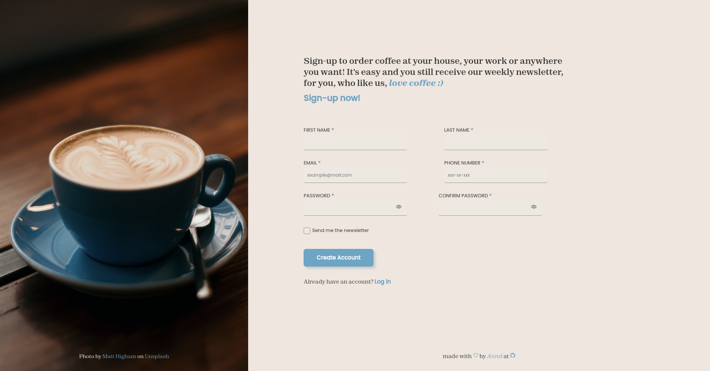

# SignUp Form Project
A simple **"SignUp Form"** project from _**The Odim Project**_ curriculum.

---
## About the Project:
A simple sign-up form where the user provide some infos and then sign up to a _ilusionary_ coffee shop which delivery coffee at home and also send a weekly newsletter about coffee related stuff if the user chooses so.

---
## Features
- Basic form structure 
- Styling concepts using pseudo-classes
- Form validation using CSS indicating whether the provided info is correct or wrong with emoji and border-color
- Password validation using JavaScript checking if they match
- Implementation of an icon that toggle the password visibility, also using JavaScript
- Prevention of submit form if inputs aren't filled or if passwords does not match
- Implementation of a welcome page when user submits form. 

---
## Resources 
- [Icons](https://ionic.io/ionicons)
- [Form image](https://unsplash.com/photos/4wl5IjEiW3A)
- [Welcome page image](https://unsplash.com/photos/j2SZHDrMgsE)
- [Fonts](https://fonts.google.com/)

--- 

## Visit the Project
Check the [project](https://anndcodes.github.io/signup-form/) out!

---

Made with ❤️ by Annd

